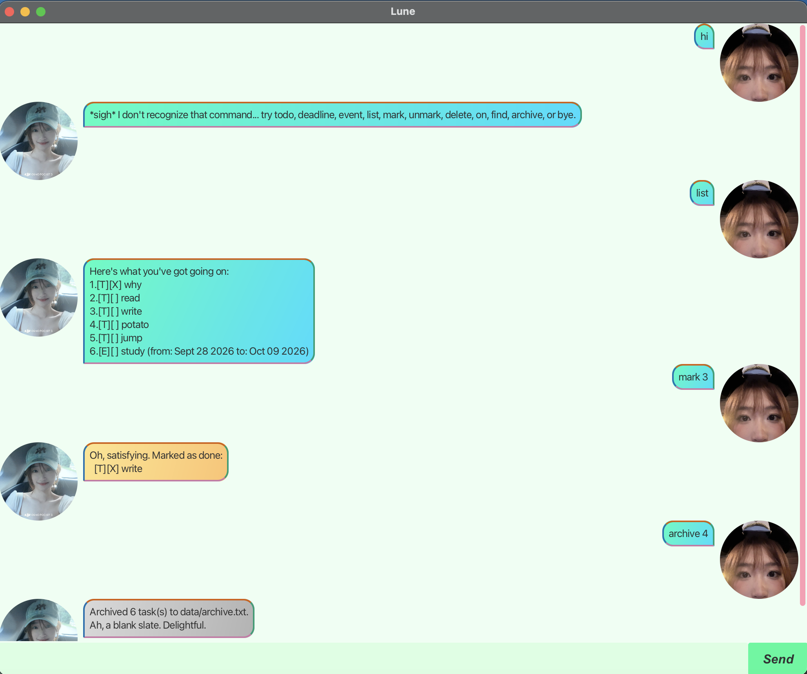

# Lune

Hi, I'm **Lune** 👋 — a friendly little chat-based task manager who'd love to help you keep your todos, deadlines, and events in order. I'm easy to type at, I remember everything between sessions, and I promise to only judge you a little bit when you leave a deadline for the last minute.

This guide will get you set up and walk you through everything I can do.



## Quick Start

1. Make sure you have **Java 25** installed on your computer.
2. Download the latest `lune.jar` from the [Releases page](https://github.com/EkulNich/ip/releases).
3. Copy the file into any folder you'd like to use as Lune's home — this is where I'll keep your saved tasks.
4. Open a terminal in that folder and run:
   ```
   java -jar lune.jar
   ```
5. A chat window should pop up. Type a command in the box at the bottom and press **Enter** (or click **Send**), and I'll take it from there!

   For example, typing `todo read a book` and hitting Enter should add your first task.

> :information_source: **Note:** I automatically save your tasks after every change, and load them again the next time you open me — no need to remember to save anything yourself.

## Features

> :information_source: **A quick note on the notation below:**
> * Words in `UPPER_CASE` are values you fill in. `todo DESCRIPTION` means you'd type something like `todo read a book`.
> * `INDEX` always refers to the number shown next to a task in `list` (starting from 1).
> * `DATE` accepts either `yyyy-mm-dd` (e.g. `2019-10-15`) or `d/m/yyyy HHmm` if you want to include a time (e.g. `2/12/2019 1800` for 6pm on 2 Dec 2019).
> * Extra spaces between words are no trouble at all — I'll tidy them up for you.

### Adding a todo: `todo`

Adds a simple task with no date attached — just something you need to do.

Format: `todo DESCRIPTION`

Example:
```
todo read a book
```
```
Added. One more thing to think about:
  [T][ ] read a book
That's 1 task(s) on the board now.
```

### Adding a deadline: `deadline`

Adds a task that needs to be done by a specific date (and optionally, time).

Format: `deadline DESCRIPTION /by DATE`

Example:
```
deadline return book /by 2019-10-15
```
```
Added. One more thing to think about:
  [D][ ] return book (by: Oct 15 2019)
That's 1 task(s) on the board now.
```

### Adding an event: `event`

Adds a task that spans from one date/time to another.

Format: `event DESCRIPTION /from DATE /to DATE`

* The `/to` date can't be earlier than the `/from` date — but they're welcome to be the same day, for a nice tidy single-day event.

Example:
```
event team meeting /from 2/12/2019 0900 /to 2/12/2019 1030
```
```
Added. One more thing to think about:
  [E][ ] team meeting (from: Dec 02 2019, 9:00 am to: Dec 02 2019, 10:30 am)
That's 1 task(s) on the board now.
```

### Listing all tasks: `list`

Shows every task currently on your list, numbered.

Format: `list`

### Marking a task as done: `mark`

Marks a task as complete. Very satisfying.

Format: `mark INDEX`

Example: `mark 2` marks the 2nd task in the list as done.

### Marking a task as not done: `unmark`

Changes a task back to not-done — for when you mark something a little too enthusiastically.

Format: `unmark INDEX`

### Deleting a task: `delete`

Removes a task from the list for good.

Format: `delete INDEX`

Example: `delete 3` removes the 3rd task in the list.

### Finding tasks by keyword: `find`

Searches every task's description for a keyword (not case-sensitive) and shows only the matches.

Format: `find KEYWORD`

Example:
```
find book
```

### Viewing tasks on a date: `on`

Shows every deadline or event that falls on a given date. (Todos don't have a date, so they never show up here.)

Format: `on DATE`

Example:
```
on 2019-10-15
```

### Archiving all your tasks: `archive`

Feeling like a clean slate? This writes every task on your list to a dated record in `data/archive.txt`, then clears your active list so you can start fresh. Nothing is lost — archiving multiple times just keeps adding new dated entries to that same file, so your whole history stays there for you to look back on.

Format: `archive`

> :bulb: **Tip:** Running `archive` with an empty list is perfectly fine — it just tells you there was nothing to file away.

### Exiting the program: `bye`

Format: `bye`

## Saving the data

I save your tasks automatically to `data/lune.txt` after every command that changes something — there's no save command, and nothing to remember. Just don't go editing that file by hand unless you're confident about the format; a line I can't understand gets skipped (with a friendly note) rather than crashing the whole list.

## FAQ

**Q: How do I move my data to another computer?**

A: Install Lune on the new computer, then copy over the `data` folder from your old one (it holds `lune.txt` and, if you've used it, `archive.txt`).

**Q: I tried to add a task that already exists — why was it rejected?**

A: I don't allow two tasks of the same type with the exact same description (case doesn't matter) — it's usually a sign you double-typed something by accident! If you really do want two very similar tasks, just phrase the description a little differently.

**Q: Can I use Lune without the GUI?**

A: The packaged jar opens the chat window by default, but if you're building from source, `./gradlew runConsole` runs the exact same Lune in a plain console instead.

## Command Summary

| Action | Format, Examples |
|---|---|
| **Todo** | `todo DESCRIPTION` <br> e.g., `todo read a book` |
| **Deadline** | `deadline DESCRIPTION /by DATE` <br> e.g., `deadline return book /by 2019-10-15` |
| **Event** | `event DESCRIPTION /from DATE /to DATE` <br> e.g., `event meeting /from 2019-10-15 /to 2019-10-16` |
| **List** | `list` |
| **Mark** | `mark INDEX` <br> e.g., `mark 2` |
| **Unmark** | `unmark INDEX` <br> e.g., `unmark 2` |
| **Delete** | `delete INDEX` <br> e.g., `delete 3` |
| **Find** | `find KEYWORD` <br> e.g., `find book` |
| **On** | `on DATE` <br> e.g., `on 2019-10-15` |
| **Archive** | `archive` |
| **Bye** | `bye` |
